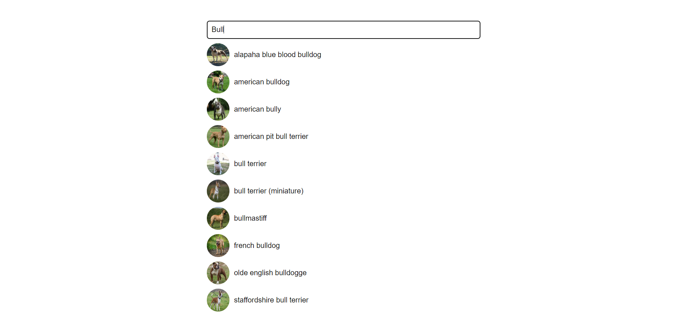

# Dog Breed Search

This project allows users to search for dog breeds and view images of the selected breed.

## Installation

1. Clone the repository: git clone https://github.com/TechnoPhasePRO/Dog-Breed-Search.git
   
2. Install dependencies: npm install

3. Start the server: node index.js

4. Open your browser and navigate to http://localhost:3000 to view the application.

5. Usage
- Type a query (e.g., bulldog) into the search box.
- As you type, possible matches will be displayed below the search box.

## Screenshots
